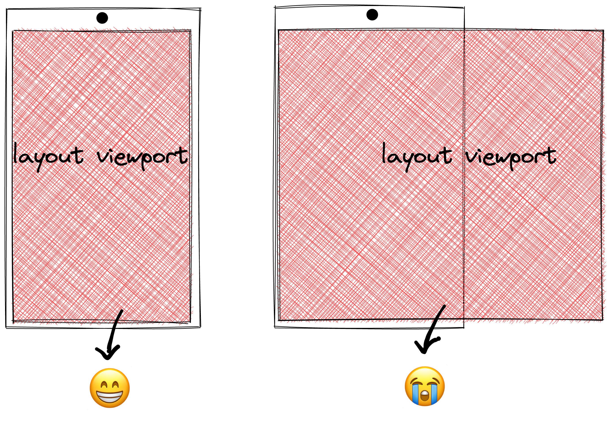

## window.innerWidth 会改变吗？

### PC

<video controls autoplay="true" muted="true">
  <source src="./viewpoint.webm" type="video/webm">
</video>

<p style="text-align: center;">不难发现，<code>window.innerWidth</code>反应的是可视区域的宽度</p>

### mobile

移动端下的 H5，值永远为手机的浏览器视口的宽度。

---

## viewport 标签它的神奇作用

> 前提：viewport 标签在 PC 端不起作用，讨论的内容仅限 H5

```html
<meta name="viewport" content="width=device-width, initial-scale=1.0" />
```

上面的 meta 标签把视口的宽度设置成和`device-width`一致（下面左图），否则的话，会
存在滚动条，展示不完全。


